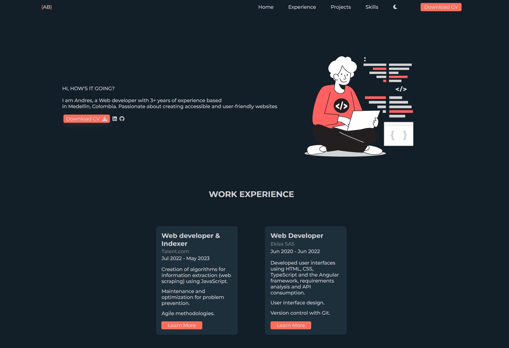
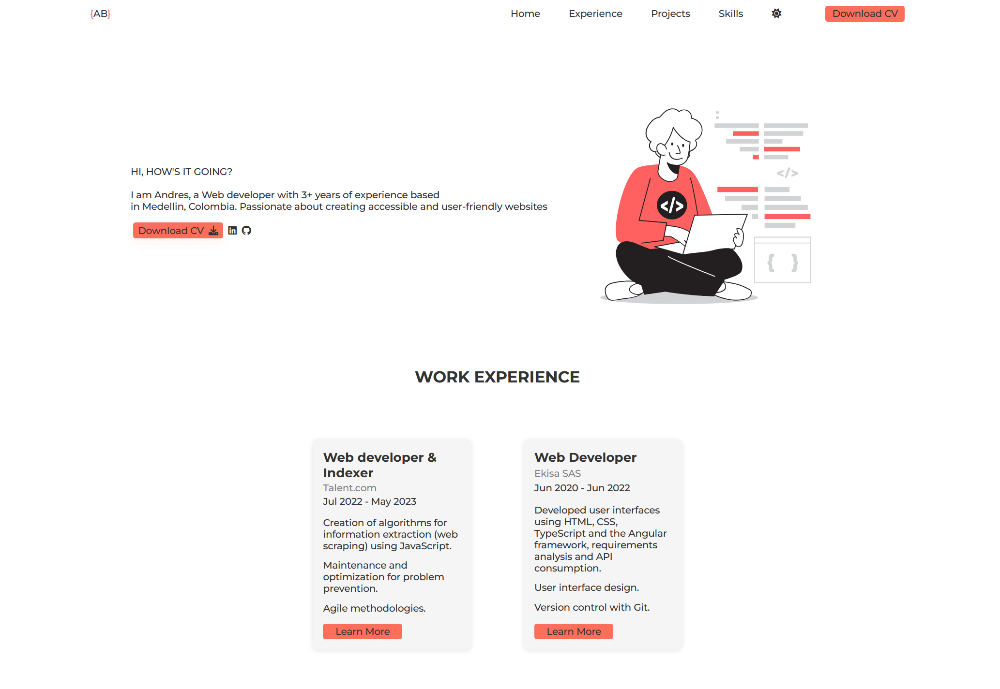

# Portfolio

This is a personal portfolio project developed by **Andrés Bolaños**

### 🔗 Links

- Live Site URL: [View live site](https://andresfelipe07b.github.io/Portfolio/)

## 🖥️ Technologies Used

- **HTML5**
- **CSS3** (con diseño responsive y variables de tema)
- **JavaScript**
- **Font Awesome & Devicon** (iconografía)
- **Google Fonts (Montserrat)**
- **Modo oscuro/claro** con CSS variables

## 📁 Project Structure

```
├── index.html # Página principal
├── style.css # Estilos personalizados con soporte para temas
├── main.js # Interactividad (menú móvil, tema)
└── /img # Imágenes de proyectos e ilustraciones
```

## 🧠 Portfolio Sections

- **Home**: Introduction and CV download link.
- **Experience**: Work experience at Talent.com and Ekisa SAS.
- **Projects**: Showcases projects like Quirón, Tempus, and ServiceApp.
- **Skills**: List of technical proficiencies.
- **Footer**: Additional navigation and social media links.

## 🚀 How to Run the Project

1. Clone this repository:
   ```bash
   git clone https://github.com/andresfelipe07b/portfolio.git
   ```
2. Open `index.html` in your browser.

> Note: Make sure to maintain the folder structure if using local images or resources.

## 📸 Preview




## 📄 License

© 2025 Andrés Bolaños. All rights reserved.
