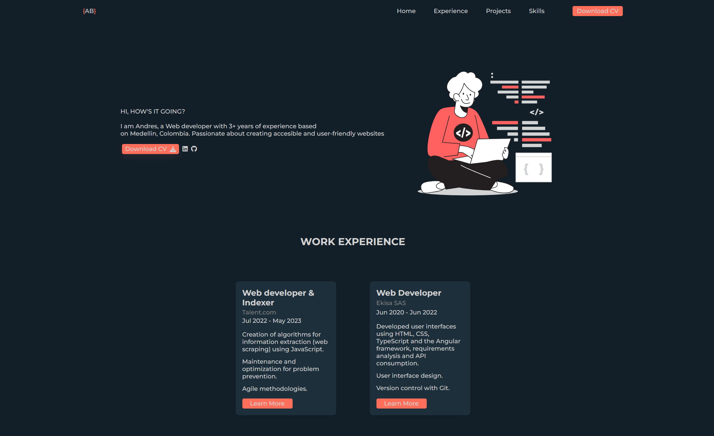

# Portfolio

This is a personal portfolio project developed by **Andrés Bolaños**, a web developer with over 3 years of experience based in Medellín, Colombia. The purpose of this website is to showcase his professional background, key projects, and technical skills.

## 🖥️ Technologies Used

- **HTML5**  
- **CSS3** (including responsive design with media queries)
- **JavaScript**
- **Font Awesome & Devicon** for icons
- **Responsive Design** for mobile devices

## 📁 Project Structure

```
.
├── index.html       # Main portfolio page
├── style.css        # Custom styles
├── main.js          # Script for interactivity (e.g., mobile menu)
└── /img             # Project and illustration images
```

## 🧠 Portfolio Sections

- **Home**: Introduction and CV download link.
- **Experience**: Work experience at Talent.com and Ekisa SAS.
- **Projects**: Showcases projects like Quirón, Tempus, and ServiceApp.
- **Skills**: List of technical proficiencies.
- **Footer**: Additional navigation and social media links.

## 🚀 How to Run the Project

1. Clone this repository:
   ```bash
   git clone https://github.com/andresfelipe07b/portfolio.git
   ```
2. Open `index.html` in your browser.

> Note: Make sure to maintain the folder structure if using local images or resources.

## 📸 Preview



## 📄 License

© 2025 Andrés Bolaños. All rights reserved.